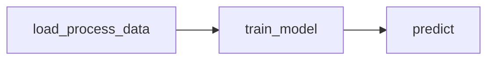

# Pipeline de MLOps

## Visión General

El pipeline está compuesto por tres etapas principales gestionadas por DVC:



## Etapas del Pipeline

### 1. Carga y Procesamiento de Datos (`load_process_data`)

**Propósito**: Cargar y procesar los datos crudos para preparar el dataset de entrenamiento.

**Dependencias**:

-   `turkish_music_emotion/dataset.py`
-   `turkish_music_emotion/config.py`
-   Datos crudos en `data/raw/${data.raw_filename}`

**Salidas**:

-   Dataset procesado en `data/processed/${data.processed_filename}`

### 2. Entrenamiento del Modelo (`train_model`)

**Propósito**: Entrenar el modelo de clasificación de emociones.

**Dependencias**:

-   `turkish_music_emotion/modeling/train.py`
-   Dataset procesado
-   Configuración del modelo

**Parámetros Principales**:

-   Tipo de modelo (RF/SVM/KNN)
-   Hiperparámetros específicos por modelo:
    -   Random Forest: `n_estimators`, `max_depth`
    -   SVM: `C`, `kernel`, `gamma`
    -   KNN: `n_neighbors`
-   Configuración de división de datos: `test_size`, `random_state`

**Salidas**:

-   Modelo entrenado
-   Codificador de etiquetas
-   Índices de división de datos

### 3. Predicción (`predict`)

**Propósito**: Realizar predicciones usando el modelo entrenado.

**Dependencias**:

-   `turkish_music_emotion/modeling/predict.py`
-   Modelo entrenado
-   Codificador de etiquetas
-   Índices de división
-   Dataset procesado

## Reproducción del Pipeline

Para reproducir el pipeline completo:

```bash
dvc repro
```

Para reproducir una etapa específica:

```bash
dvc repro <stage_name>
```

Para ver el estado actual del pipeline:

```bash
dvc status
```

## Control de Versiones

El pipeline utiliza DVC para el versionado tanto del código como de los datos, permitiendo:

-   Reproducibilidad completa de experimentos
-   Trazabilidad de cambios en datos y modelos
-   Gestión eficiente de artefactos grandes

## Métricas y Seguimiento

Para ver las métricas actuales:

```bash
dvc metrics show
```

Para comparar con versiones anteriores:

```bash
dvc metrics diff
```
