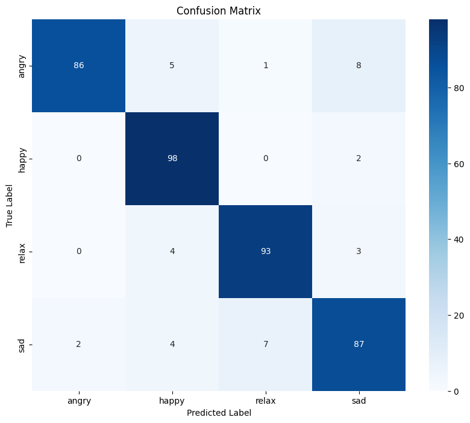

## Evaluación del modelo de clasificación de emociones en la música turca

### Métricas de evaluación
Se utilizaron las siguientes métricas para evaluar el modelo:
* **Accuracy:** Proporción de clasificaciones correctas.
* **F1-score:** Media armónica de precisión y recall.
* **Recall:** La capacidad del modelo para encontrar todos los casos positivos.
* **Precision:** medición de la exactitud de las predicciones positivas del modelo.

### Resultados de la evaluación
En el conjunto de prueba, el modelo obtuvo un accuracy del 91%, recall de 91%, precision de 91% y un F1-score del 90%.

