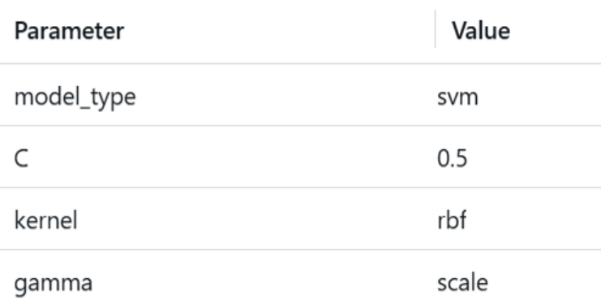
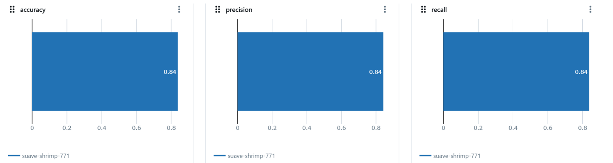

## Entrenamiento del modelo de clasificación de emociones en la música

### Configuración del entrenamiento
* **Librerías:** pandas, numpy, json, yaml, mlflow, sklearn, entre otras.
* **random_state**

### Definición del modelo
* **Arquitectura:** Clasificación utilizando los algoritmos Random Forest, Máquina de vector de soporte y KNN.
* **Hiperparámetros iniciales:**

    Random Forest: n_estimators: 50, max_depth: 5

    SVM: C: 1.0, kernel: 'rbf', gamma: 'scale'

    KNN: n_neighbors: 5

### Párametros de Entrenamiento del modelo

### Evaluación del modelo
* **Métricas:** Accuracy, precision, recall, F1-score
* **Resultados:** En el conjunto de prueba se obtuvo un accuracy del 91% con el algoritmo máquina de vector de soporte (svm).

A continuación los valores obtenidos para 3 de las 4 métricas:

